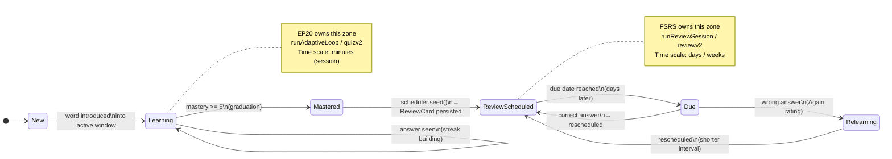
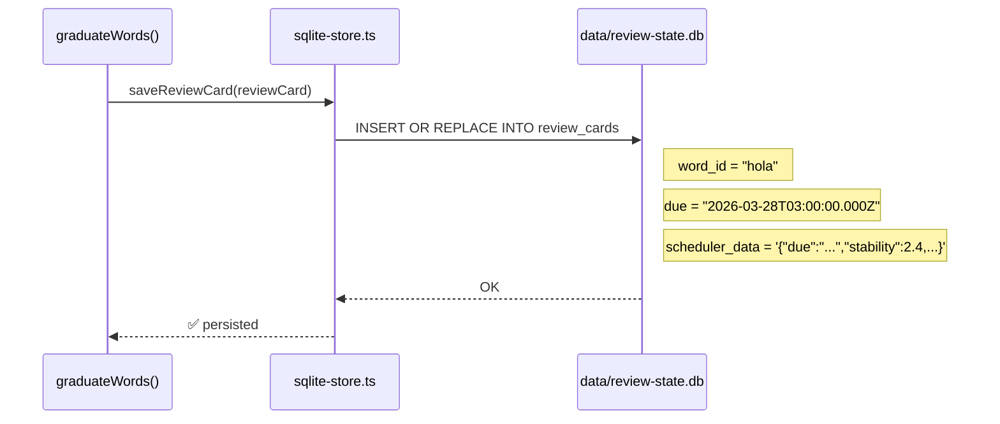
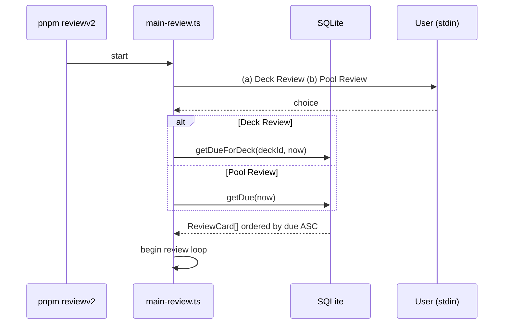
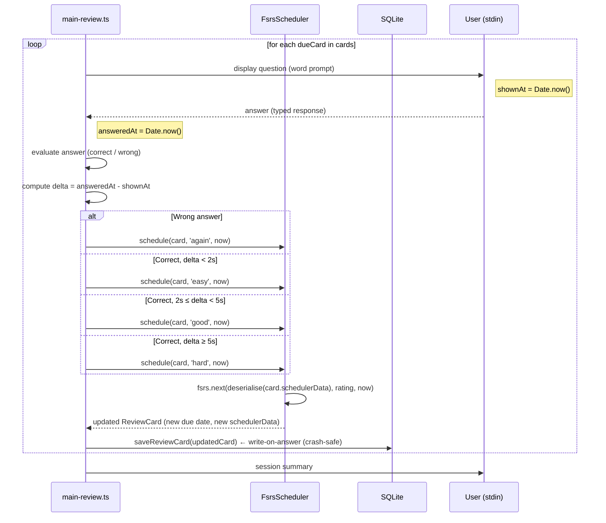
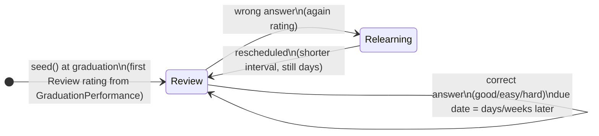

# Flow Walkthrough: Learning Phase → Review Phase
## SRS Engine v2 — End-to-End Transition

**Date**: 20260321T152054Z
**Status**: Draft
**Related ADR**: [SRS Engine v2 — Review Phase](../architecture/20260321T145300Z-engineering-srs-engine-v2-review-phase.md)
**Related ADR**: [SRS Engine v2 — Learning Phase](../architecture/20260319T000000Z-engineering-srs-engine-v2-learning-phase.md)
**Epic**: EP21

> **Scope**: From the final batch of `runAdaptiveLoop` completing, through graduation seeding, to the first `pnpm reviewv2` session.

---

## 1. The Big Picture — Two Phases, Two Owners



---

## 2. Learning Phase Recap — What Builds Up Before Graduation

The Learning phase accumulates state on every `WordState` that is handed off at graduation. Understanding what gets tracked here explains *why* the FSRS seeding is informed, not cold.

### 2a. `WordState` fields at play

| Field | Type | Set during Learning | Used at graduation |
|---|---|---|---|
| `wordId` | `string` | ✅ Identity | ✅ Key for `ReviewCard` |
| `mastery` | `number` (0–5) | ✅ increments/decrements on streak | ✅ must be `>= masteryThreshold` (5) to graduate |
| `correctStreak` | `number` | ✅ consecutive corrects | ✅ input to `GraduationPerformance` |
| `wrongStreak` | `number` | ✅ consecutive wrongs | — (resets at graduation) |
| `lapses` | `number` | ✅ each mastery decrement = +1 lapse | ✅ input to `GraduationPerformance` |
| `seen` | `number` | ✅ total times presented | — |
| `correct` | `number` | ✅ total correct answers | ✅ drives `correctRatio` |
| `reviewCard?` | `ReviewCard \| undefined` | ❌ absent | ✅ populated at graduation |

### 2b. Mastery mechanics (streak-driven)

```
Correct answer:
  correctStreak += 1
  wrongStreak = 0
  if correctStreak >= correctStreakThreshold (3):
    mastery = min(5, mastery + 1)

Wrong answer:
  wrongStreak += 1
  correctStreak = 0
  if wrongStreak >= wrongStreakThreshold (2):
    mastery = max(0, mastery - 1)
    lapses += 1          ← lapses counter increments here

Retirement check (after every update):
  if mastery >= masteryThreshold (5): word is MASTERED → retire from active
```

> **Note**: Streaks are **not reset** after a mastery change. A word on a hot streak climbs fast; a struggling word drops fast. This is intentional — it means `lapses` is a faithful record of genuine instability during acquisition.

---

## 3. The Graduation Moment — End of `runAdaptiveLoop`

```mermaid
sequenceDiagram
    participant Loop as runAdaptiveLoop
    participant WS as WordState[]
    participant Grad as graduateWords()
    participant Sched as FsrsScheduler
    participant Store as SQLite (review_cards)

    Loop->>Loop: batch N: last word answers question
    Loop->>WS: updateRunState(ws, answer)
    WS-->>Loop: mastery = 5 ✅ isMastered = true
    Loop->>Loop: retire word from active pool
    Loop->>Loop: active = [] ∧ queue = [] → RUN COMPLETE

    Note over Loop,Store: Post-run graduation block
    loop for each masteredWord in completedWords
        Loop->>Grad: extract GraduationPerformance
        Grad-->>Loop: { correctStreak, lapses, correctRatio }
        Loop->>Sched: scheduler.seed(wordId, perf)
        Sched->>Sched: map perf → InitialRating (Easy/Good/Hard)
        Sched->>Sched: fsrs.next(emptyCard, InitialRating, now)
        Sched-->>Loop: ReviewCard { wordId, due, schedulerData }
        Loop->>Store: persist(ReviewCard)
        Loop->>WS: ws.reviewCard = ReviewCard
    end

    Loop-->>Loop: session complete ✅
```

### 3a. `GraduationPerformance` extraction

```ts
// Computed from final WordState at the moment of mastery retirement
const perf: GraduationPerformance = {
  correctStreak: ws.correctStreak,    // final streak value (e.g. 4)
  lapses:        ws.lapses,           // total mastery drops during run (e.g. 1)
  correctRatio:  ws.correct / ws.seen // e.g. 14/17 = 0.82
};
```

### 3b. Initial FSRS rating mapping

See [Review Phase ADR §5](../architecture/20260321T145300Z-engineering-srs-engine-v2-review-phase.md) for the full rationale. Summary:

| Graduation signal | Rating assigned | FSRS effect |
|---|---|---|
| High `correctStreak`, `lapses === 0` | `Easy` | Higher initial stability → **longer** first interval |
| Moderate streak, `lapses` 1–2 | `Good` | Standard initial stability |
| Low `correctStreak`, multiple `lapses`, low `correctRatio` | `Hard` | Lower initial stability → **shorter** first interval |

> **Important**: Exact numeric thresholds for Easy/Good/Hard boundaries are **not yet calibrated** — this is OQ5 in EP21.

### 3c. `ReviewCard` created by `FsrsScheduler.seed()`

```ts
// Inside FsrsScheduler.seed()
const emptyCard = createEmptyCard();                        // ts-fsrs new card
const result = fsrs.next(emptyCard, now, initialRating);    // enable_short_term: false
const scheduled = result[initialRating];                    // pick the rated outcome

return {
  wordId,
  due:           scheduled.card.due,            // Date, days from now
  schedulerData: JSON.stringify(scheduled.card) // opaque blob — ts-fsrs Card fields
};
//      ↑ This is the ReviewCard persisted to SQLite
```

---

## 4. Persistence — Writing the `ReviewCard` to SQLite



```sql
-- Schema (created on first run)
CREATE TABLE IF NOT EXISTS review_cards (
  word_id        TEXT PRIMARY KEY,
  due            TEXT NOT NULL,       -- ISO 8601 string
  scheduler_data TEXT NOT NULL        -- JSON blob, opaque to persistence layer
);
```

> **Note**: `scheduler_data` is **never read or mutated** by the persistence layer. Only `FsrsScheduler` deserialises it. This means swapping the scheduler doesn't require a schema migration. See [Review Phase ADR §3 & §9](../architecture/20260321T145300Z-engineering-srs-engine-v2-review-phase.md).

---

## 5. Time Passes — Due Date Arrives

After graduation, `ReviewCard.due` is a future date (e.g. 7 days from graduation if rated `Good`). Nothing happens to the word until `pnpm reviewv2` is run on or after that due date.

```
pnpm quizv2  ← Learning session (runAdaptiveLoop)
             ↓  graduation writes ReviewCards to SQLite
             ↓
             ⏱  days pass  (e.g. 7 days)
             ↓
pnpm reviewv2 ← Review session (runReviewSession)
```

---

## 6. Review Session — `pnpm reviewv2`

### 6a. Session startup



See [Review Phase ADR §11](../architecture/20260321T145300Z-engineering-srs-engine-v2-review-phase.md) for the deck-scoped vs pool-global modes.

### 6b. Per-card review loop



### 6c. Rating inference — response time thresholds

See [Review Phase ADR §6](../architecture/20260321T145300Z-engineering-srs-engine-v2-review-phase.md) for rationale on no-self-rating UI.

| Answer | Response time | Rating | FSRS effect |
|---|---|---|---|
| Wrong | any | `again` | Relearning; next due is days away (short_term disabled) |
| Correct | < 2s | `easy` | Stability increases strongly → long next interval |
| Correct | 2–5s | `good` | Stability increases normally |
| Correct | > 5s | `hard` | Stability increases minimally → shorter next interval |

> **Note**: Thresholds (2s / 5s) are configurable constants in `main-review.ts`. Initial estimates — empirical tuning needed.

---

## 7. State Machine After `enable_short_term: false`

Because FSRS's within-day learning steps are bypassed (see [Review Phase ADR §1](../architecture/20260321T145300Z-engineering-srs-engine-v2-review-phase.md)), the effective state machine is simplified:



> **Note**: The `New` and `Learning` FSRS states are **never entered**. `FsrsScheduler.seed()` produces a card directly in `Review` state.

---

## 8. Annotated Data Flow — One Word End-to-End

Tracing `wordId = "hola"` from first seen to second review:

```
━━━━━━━━━━━━━━━━━━━━━━━━━━━━━━━━━━━━━━━━━━━
DAY 0 — Learning session (pnpm quizv2)
━━━━━━━━━━━━━━━━━━━━━━━━━━━━━━━━━━━━━━━━━━━

"hola" introduced into active window

Batch 1:  ✓  { seen:1, correct:1, mastery:0, correctStreak:1, lapses:0 }
Batch 2:  ✗  { seen:2, correct:1, mastery:0, correctStreak:0, wrongStreak:1, lapses:0 }
Batch 3:  ✗  { seen:3, correct:1, mastery:0, correctStreak:0, wrongStreak:2 }
             wrongStreak >= 2 → mastery decrement blocked (already 0), lapses:1
Batch 4:  ✓  { seen:4, correct:2, mastery:0, correctStreak:1, wrongStreak:0, lapses:1 }
Batch 5:  ✓  { seen:5, correct:3, mastery:0, correctStreak:2, lapses:1 }
Batch 6:  ✓  { seen:6, correct:4, mastery:1, correctStreak:3, lapses:1 }
             correctStreak >= 3 → mastery += 1
...
Batch 12: ✓  { seen:12, correct:10, mastery:5 }  🎓 MASTERED
             correctRatio = 10/12 = 0.83

━━━━━━━━━━━━━━━━━━━━━━━━━━━━━━━━━━━━━━━━━━━
GRADUATION BLOCK (end of runAdaptiveLoop)
━━━━━━━━━━━━━━━━━━━━━━━━━━━━━━━━━━━━━━━━━━━

GraduationPerformance {
  correctStreak: 4         ← final streak at graduation moment
  lapses: 1                ← had 1 mastery drop (moderate)
  correctRatio: 0.83       ← solid but not perfect
}

→ Rating mapping: lapses=1, goodish ratio → "Good"
→ FsrsScheduler.seed("hola", perf)
  → fsrs.next(emptyCard, Good, now)
  → due: 2026-03-28  (7 days, typical Good first interval)
  → schedulerData: { stability: 2.4, difficulty: 5.1, state: "Review", ... }

SQLite → INSERT review_cards
  word_id: "hola"
  due: "2026-03-28T00:00:00.000Z"
  scheduler_data: '{"stability":2.4,"difficulty":5.1,"state":"Review",...}'

━━━━━━━━━━━━━━━━━━━━━━━━━━━━━━━━━━━━━━━━━━━
DAY 7 — Review session (pnpm reviewv2)
━━━━━━━━━━━━━━━━━━━━━━━━━━━━━━━━━━━━━━━━━━━

getDue(now) → "hola" due date 2026-03-28 <= now ✅

Question displayed: "What does 'hola' mean?"
shownAt: 09:00:00.000

User answers: "hello"   ✓ correct
answeredAt: 09:00:03.450
delta: 3450ms → between 2s and 5s → rating: "good"

FsrsScheduler.schedule(card, "good", now)
  → fsrs.next(deserialise(schedulerData), "good", now)
  → new due: 2026-04-15  (18 days — stability built up)
  → new schedulerData: { stability: 6.2, difficulty: 5.1, state: "Review", reps: 1, ... }

Write-on-answer:
SQLite → UPDATE review_cards SET due="2026-04-15...", scheduler_data="..." WHERE word_id="hola"

━━━━━━━━━━━━━━━━━━━━━━━━━━━━━━━━━━━━━━━━━━━
DAY 25 — Review session
━━━━━━━━━━━━━━━━━━━━━━━━━━━━━━━━━━━━━━━━━━━

"hola" due again.

User answers correctly in 1.2s → rating: "easy"
→ new due: ~60 days (stability grows significantly)
```

---

## 9. What the `WordState` Looks Like at Each Stage

| Stage | `mastery` | `reviewCard` | In active pool? | In SQLite? |
|---|---|---|---|---|
| New (unseen) | — | absent | ❌ (in queue) | ❌ |
| Learning (active) | 0–4 | absent | ✅ | ❌ |
| Mastered (just graduated) | 5 | ✅ populated | ❌ (retired) | ✅ |
| Due for Review | 5 | ✅ (due ≤ now) | ❌ | ✅ |
| Reviewed (rescheduled) | 5 | ✅ (due in future) | ❌ | ✅ (updated) |
| Failed Review (Relearning) | 5 | ✅ (shorter due) | ❌ | ✅ (updated) |

> **Note**: Re-entry into EP20's Learning phase after a Review failure is **OQ1** in EP21 — not yet designed. Currently, a failed review word stays in FSRS Relearning state with a shortened interval.

---

## 10. Open Questions That Affect This Flow

All tracked in EP21. See [Review Phase ADR Open Questions](../architecture/20260321T145300Z-engineering-srs-engine-v2-review-phase.md#open-questions).

| # | Where it bites in the flow | Question |
|---|---|---|
| OQ1 | §6b — wrong answer in Review | When does a failing Review word re-enter Learning? What mastery level does it reset to? What happens to its `ReviewCard`? |
| OQ2 | §6a — session startup | Does `pnpm reviewv2` auto-resume remaining due cards from a partial session, or prompt the user? |
| OQ3 | §3b — graduation seeding | Per-word-type mastery thresholds (5 foundational / 10 curated) — EP21 or later? |
| OQ4 | §6b — ongoing review | Stuck word shelving in Review phase (EP21) |
| OQ5 | §3b & §6c | Exact thresholds for Easy/Good/Hard graduation mapping + response-time thresholds |
| OQ6 | §4 — persistence | One `ReviewCard` per `wordId` globally, or one per `(wordId, deckId)` pair? |

### Additional open questions (not yet in EP21)

| # | Question |
|---|---|
| AQ1 | **Shelving logic in Review phase only** — what does it mean to shelve a word that is already graduated? How does it interact with the `ReviewCard` in SQLite? |
| AQ2 | **Enthusiastic learner problem** — a user who keeps revisiting words and ignores FSRS scheduling. Does the system allow session-on-demand (bypassing due date check)? Does doing so corrupt FSRS stability data? Should there be a "practice mode" vs "scheduled review mode" distinction? |

---

## 11. Component Boundaries Summary

```
┌──────────────────────────────────────┐
│         pnpm quizv2                  │
│  runAdaptiveLoop (runner/interactive)│
│  ├── WordState tracking              │
│  ├── Streak / mastery updates        │
│  ├── Active window management        │
│  └── graduation block ───────────────┼──┐
└──────────────────────────────────────┘  │
                                          ▼
                              ┌──────────────────────┐
                              │   ReviewScheduler    │   ← domain interface
                              │   FsrsScheduler      │   ← ts-fsrs adapter
                              │   .seed()            │
                              └──────────┬───────────┘
                                         │ ReviewCard
                                         ▼
                              ┌──────────────────────┐
                              │   SQLite             │
                              │   review_cards table │
                              └──────────┬───────────┘
                                         │ getDue / getDueForDeck
                                         ▼
┌──────────────────────────────────────┐
│         pnpm reviewv2                │
│  runReviewSession (main-review.ts)   │
│  ├── mode selection (deck / pool)    │
│  ├── question display                │
│  ├── response-time rating inference  │
│  ├── scheduler.schedule()           │
│  └── write-on-answer persist         │
└──────────────────────────────────────┘
```

---

## Related

- [SRS Engine v2 — Review Phase ADR](../architecture/20260321T145300Z-engineering-srs-engine-v2-review-phase.md)
- [SRS Engine v2 — Learning Phase ADR](../architecture/20260319T000000Z-engineering-srs-engine-v2-learning-phase.md)
- [EP21 — SRS Engine v2 Revision Phase](../../.agents/plans/epics/EP21-srs-engine-v2-revision-phase.md)
- [SRS Scheduling Libraries Research](../research/20260319T000000Z-srs-scheduling-libraries.md)
